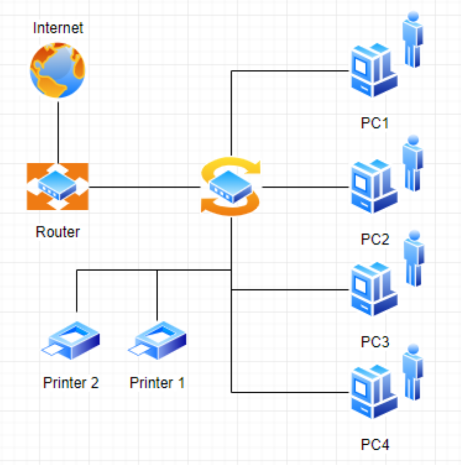
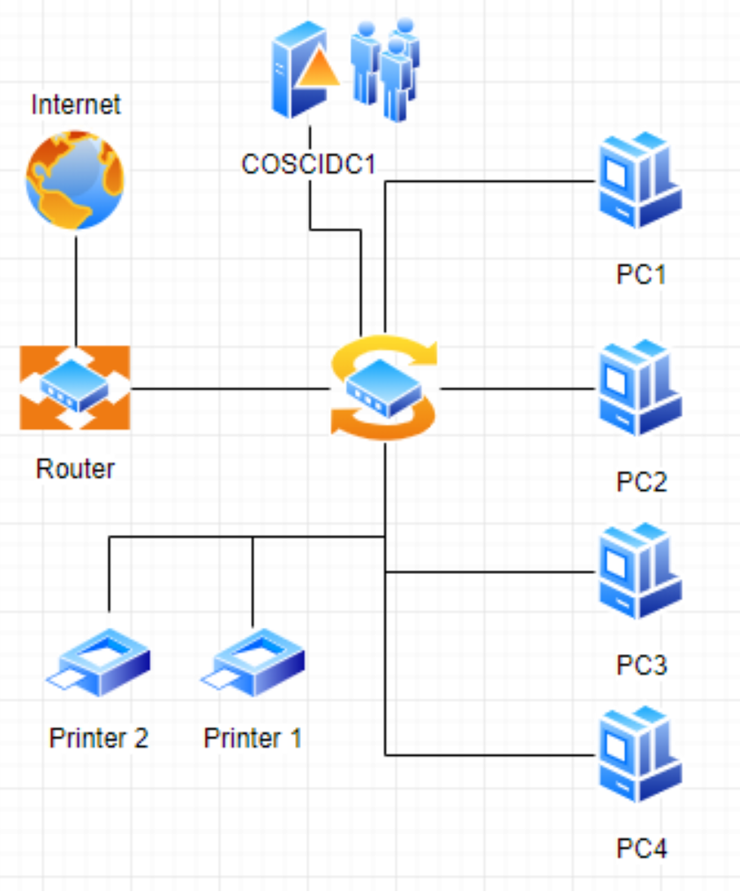
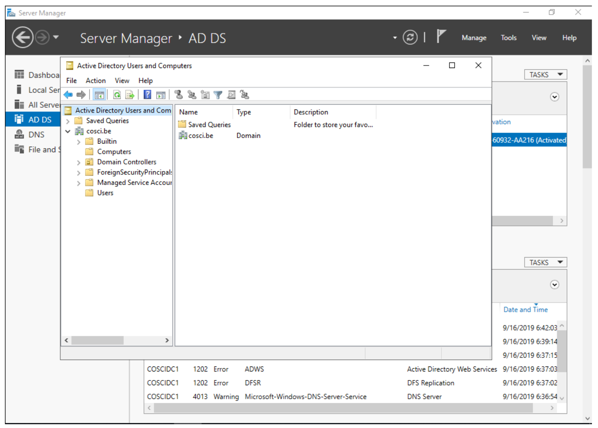
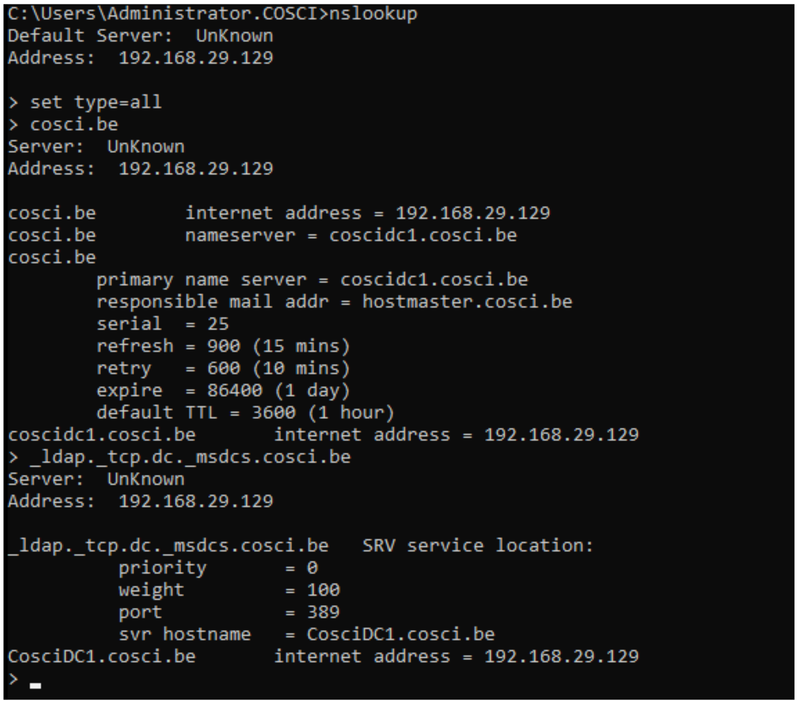
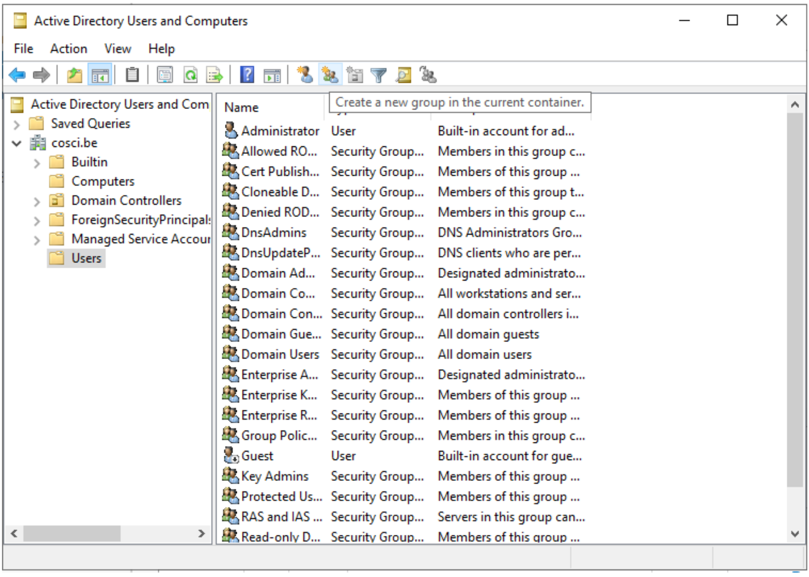
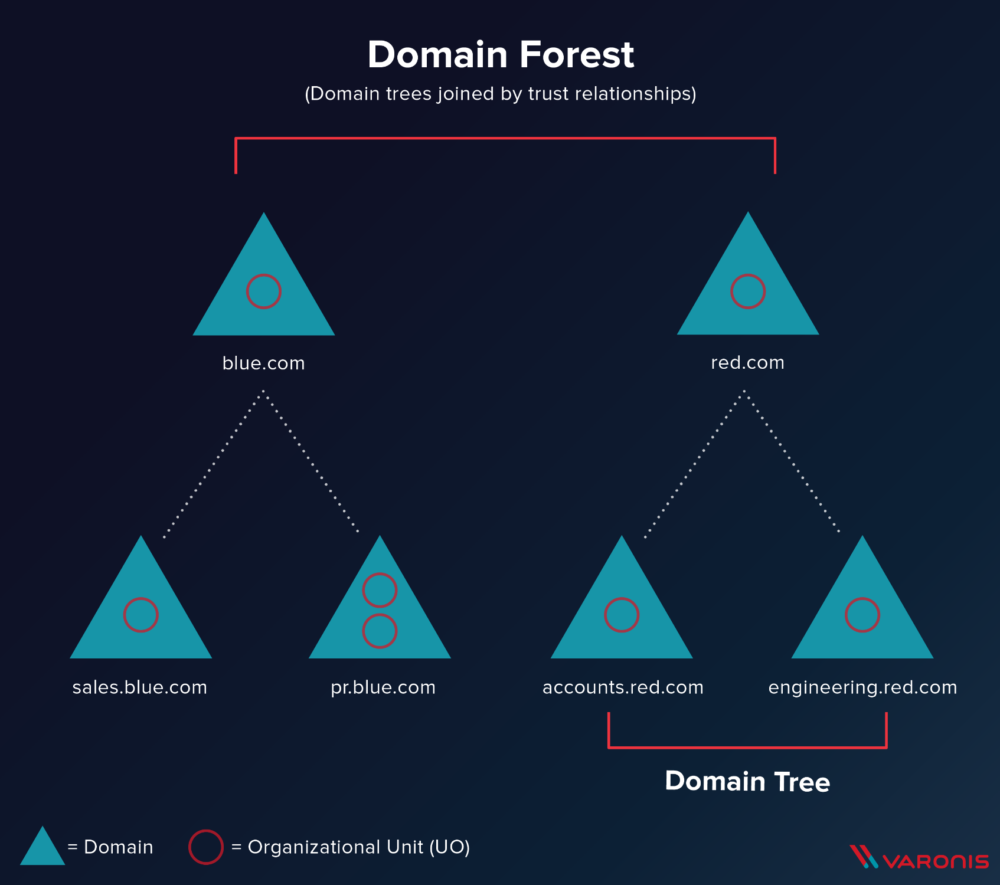
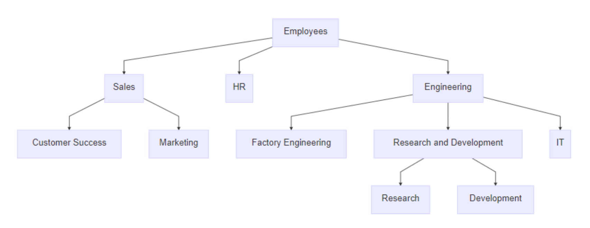

= Active Directory
UCLL
:doctype: article
:encoding: utf-8
:lang: nl
:toc: left

== Inleiding

De firma Cosci heeft op dit moment een 70-tal Windows PC's.

Hieronder een schema zoals het  bedrijfsnetwerk er momenteel uitziet. Eén router is met het internet verbonden, aan die router is een switch verbonden, en op de switch hangen een heleboel PC's en printers.

Iedere keer dat er een nieuwe werknemer wordt aangenomen, moet de ICT-afdeling een nieuwe PC klaarmaken, er een lokaal account op maken en deze gaan plaatsen op het bureau. Ook wanneer een personeelslid van afdeling verhuist, moet ze handmatig een nieuw account gaan maken op de PC die er staat. Iedere keer wanneer een gebruiker zijn wachtwoord vergeet, moet een administrator op alle PC's waarop deze gebruiker werkt, aanmelden met het Administrator-account en het paswoord lokaal op de PC veranderen.

De ICT-afdeling heeft gehoord dat dit efficiënter kan door de PC's aan een **Active Directory-server** te koppelen, waarop ze alle PC's en gebruikers vanop één centrale plaats kunnen beheren. Ook het beheer van printers en PC-instellingen zouden eenvoudiger via dit Active Directory kunnen verlopen.

NOTE: Active Directory bestaat uit meer dan alleen een Active Directory Domain Controller. Voor de eenvoud van dit labo gaan we er van uit dat een Windows Domain hetzelfde is als een Active Directory Domain of een Domain en dat dit  Domain wordt beheerd of invulling krijgt door middel van een Domain Controller die, ook wel Active Directory Domain Controller genoemd.

== Windows Domein
Om te beginnen aan dit labo moeten we eerst begrijpen wat een Windows Domain is. Een Windows Domain is een logisch netwerk, waarin alle user-accounts, computers, printers, netwerkschijven, ... geregistreerd zijn op een centrale server, de Active Directory Domain Controller. Doordat alles centraal geregistreerd is, kunnen we het ook centraal beheren. Dit geeft ons een heleboel mogelijkheden:

* Gecentraliseerd gebruikersbeheer: alle gebruikersaccounts worden bijgehouden op de server, niet op de client PC's
* We kunnen op de server bepalen welke users aan welke resources (printers, netwerkshares, ...) kunnen.
* Gemakkelijk te schalen wanneer het aantal gebruikers en PC's groter wordt

IMPORTANT: In dit labo gaan we een Active Directory Domain Controller installeren, een PC toevoegen aan het domein, gebruikers aanmaken op de Domain Controller die we dan laten aanmelden op de PC.

== Installatie Windows Server

Om een Donein Controller te installeren, moeten je eerst een Windows Server hebben.

1. Download de ISO van Windows Server 2019 op https://files.ucll.be[https://files.ucll.be] (Education->CourseInfo->Management en Technologie->Management Leuven->Toegepaste Informatica->1TI->Besturingsystemen_1->ISOs).
2. In VMWare selecteer je "Create a new Virtual Machine".
3. Je gebruikt de "typical" configuratie.
4. Bij Installer-Disk-image selecteer je de ISO die je gedownload hebt. VMWare zal normaal gezien automatisch herkennen dat dit een Windows-Installatie is.
5. Je kan vanuit VMWare automatisch een user-account laten maken. Als gebruikersnaam gebruiken we `Administrator` en als wachtwoord `p@ssw0rd`.
6. Wanneer je volledig door de set-up bent gegaan zal Windows Server automatisch beginnen installeren. Op een gegeven moment vraagt de installer of je Windows Server Core of Desktop-Experience wilt gebruiken. Voor gebruiksgemak kiezen we hier voor Standard Desktop-Experience, NIET de core-editie.

Terwijl je wacht op de installatie, bekijk je het volgende https://www.youtube.com/watch?v=GfqsFtmJQg0[filmpje]. Daarin wordt uitgelegd wat we allemaal kunnen doen met Active Directory, en met welke tools we Active Directory Domain kunnen beheren.

== Installatie Windows 10 Client
Hiernaast willen we natuurlijk ook een client Windows 10 uitvoeren. De procedure hiervoor is zeer gelijkaardig aan die van de server.

Om communicatie tussen de twee machines mogelijk te maken zal je **Windows Device Discovery en FileSharing** moeten aanzetten. Door dit te doen, worden bepaalde poorten op de firewall opengezet, die belangrijk zijn voor het delen van bestanden en informatie voor Windows-machines. De gemakkelijkste manier is om de verkenner te openen en naar 'Network' te gaan. Er verschijnt bovenaan een gele balk die meldt dat device discovery uitstaat. Je kan deze aanzetten door er op te klikken. Dit moet je uiteraard op beide machines doen. **Test hierna of de twee machines elkaar kunnen pingen**.

TIP: `cmd`, `ipconfig`, `ping`

== Windows Server Manager
=== Rollen
Een Windows Server wordt doorgaans geconfigureerd via Windows Server Manager, een programma dat standaard geïnstalleerd is op alle installaties van Windows Server. Met deze tool kan je een heleboel extra "componenten" op je server installeren, zoals Active Directory, een DHCP server, een Fax-server, ... Deze componenten noemen we _Roles_, de "primaire" programma's.

=== Features
Daarnaast kan je ook features installeren. Features zijn programma's of add-ons die niet zozeer impact hebben op de functionaliteit van de primaire programma's, maar extra functies voorzien. Een heel bekende feature is PowerShell, de bekende scripting-taal van Microsoft.

== Installatie Active Directory
Zoals besproken worden in een Domein alle gebruikersaccounts, PC's, printers, ... centraal bijgehouden. De databank of database waarin deze worden opgeslagen noemen we een 'Directory'. Er zijn een heleboel Directory-softwarepakketten (OpenLDAP, Samba, FreeIPA, 389 Directory Server, ...) maar verreweg de meest gebruikte is en blijft Windows Active Directory.

Deze kunnen we natuurlijk heel eenvoudig installeren op onze Windows Server.

=== Voorbereiding
Eerst en vooral gaan we de server een logische naam geven. Open **Server Manager** en ga naar **Local Server**. Klik op de computernaam, vervolgens op 'Change...'. Geef de server de naam 'COSCIDC1'. Om die wijzigingen door te voeren moet je de server opnieuw opstarten.

Stel ook een statisch IP in. Hiervoor neem je best het IP dat door de DHCP-server van VMware is toegekend aan je server, samen met het subnet-mask en de default-gateway.

TIP: Je kan uiteraard altijd https://lmgtfy.com/?q=windows+server+2019+set+static+ip[op het internet rekenen] om te ontdekken hoe dit moet.

=== Installatie
1. Klik in Server Manager op "Manage" rechtsbovenaan en selecteer "Add Roles and Features".
2. Bij Installation Type kies je voor "Role-based or feature-based installation".
3. Onder "Server Roles" kies je voor "Active Directory Domain Services", het belangrijkste onderdeel van Active Directory. Pas als dit onderdeel op de server geïnstalleerd is, spreken we van een Domain Controller.
4. Loop verder door de installatie. Deze begint vanzelf. Wanneer de installatie gedaan is krijg je de melding "Configuration required". Klik door op "Promote this server to Domain Controller". Je krijgt een venster "Deployement configuration."
5. Gezien dit onze eerste Domain Controller is, willen we een nieuwe forest maken. Er wordt gevraagd om een "Root domain name". Die is in ons geval `cosci.be`, de domeinnaam waarvan we willen vertrekken voor de rest van onze domeinen.
6. In Domain Controller laten we Domain Name System (DNS) server aangevinkt. Dit zal automatisch een DNS-server installeren voor het domein `cosci.be`.
7. Onder additional options laten we de NetBIOS domain name staan op 'COSCI'. Dit is een verkorte naam waarmee we later kunnen verwijzen naar het domein.
8. Loop verder door de installer. De server moet herstart worden nadat de installatie voltooid is.

=== Controle
Als je alle stappen hebt gevolgd, heb je nu een Active Directory server geïnstalleerd, met als root-domain `cosci.be`. Daarnaast is er ook automatisch een DNS-server geïnstalleerd, met de juiste records voor `cosci.be`. Om dit na te gaan openen we het programma "Active Directory Users and Computers". Als je alles goed gedaan hebt zie je `cosci.be` als domein staan.

== Een computer opnemen in een domein
Active  Directory  gebruikt  het  DNS-protocol om aan client pc’s door te geven welke server de domain controller  is.Bij  de  installatie  van  de  Active  Directory  rol  op  de  server,  gaat  automatisch  ook  de  DNS server rol mee geïnstalleerd worden. Als we willen dat de client computers nu het domein dat we aangemaakt hebben kunnen vinden, dan moeten we dus de DNS-settings op die client eerst juist instellen. Open op de Windows 10 client machine  de netwerkeigenschappen (waar je het IP-adres van de client ingesteld hebt), en stel het IP-adres van de DNS server in op het IP-adres van de Windows Server machine.

De Windows10-computer **kan dan pas** opgenomen worden als cliënt in het domein. Klik op Start→rechter klik op This PC→Properties→Change Settings→Change. Om een computer toe te voegen aan een domein moet je wel over enige rechten beschikken:

* Op de machine die men opneemt, moet men beheerdersrecht (Administrator) hebben
* Als men de machine wil toevoegen aan een domein, moet men de naam en het paswoord kunnen opgeven van een account van het domein die het recht heeft om computers in het domein op te nemen (bvb. de Domein Administrator).

Geef je de PC een logische naam, en als domeinnaam geef je `cosci.be` in. Wanneer er een gebruikersnaam en wachtwoord gevraagd wordt, geef je de gegevens van de beheerder van de server op (Administrator:t). Hierna zou je een welkomstberichtje moeten krijgen. Start de computer opnieuw op.

NOTE:  Na herstarten kan men met 2 soorten accounts inloggen: de accounts die lokaal op de pc gedefinieerd waren (en blijven) en de accounts die globaal (d.i. op het domein) gedefinieerd zijn. (Momenteel hebben we er nog geen globaal account aangemaakt)

=== Wat gebeurt hier nu eigenlijk als een client opgenomen wordt in een domein?
Doordat we op de Windows 10 client onze Windows Server als DNS-server hebben ingesteld, worden alle DNS-queries van de client naar de server gestuurd. Op de server werd een DNS-server geïnstalleerd toen we de Active Directory installeerden, dus onze server kan op die queries ook antwoorden.

Toen we in de Windows 10 client `cosci.be` als domein opgaven, ging de PC dus een DNS-query uitsturen voor `cosci.be`, naar onze server. Deze DNS-query is echter een beetje speciaal, hij zoekt namelijk niet gewoon naar het IP-adres van het domein, maar naar een heel specifiek record, een **SRV-record**.

Een SRV-record is een record in DNS waarin je een bepaalde service beschrijft, alsook het ip-adres, de poort, en de priority van deze service. Hieronder zie je de afdruk van een NSLookup.

Wanneer we een client opnemen in het domein `cosci.be` wordt er een query gedaan naar `ldap._tcp.dc._msdcs.cosci.be`, en de client krijgt als antwoord het IP en de poort waar het op draait. Test dit zeker zelf ook eens uit.

TIP: NSLookup is een tool die je veel nodig gaat hebben voor het opsporen van problemen. Het volledige commando hier uitleggen met al zijn opties is omslachtig. De help-functie en Google zijn uw vriend.

== Gebruikers aanmaken in het domein
De volgende stap is om gebruikers aan te maken in het domein. Hiervoor gaan we terug naar de server en openen we de **Active Directory Users and Computers**-tool (ADUC). Als je de tab cosci.be openklikt, zie je een aantal voorgemaakte mapjes staan. Als je op Computers klikt, zal je de PC die we zonet hebben opgenomen, zien staan. Als je op Users klikt zie je een heleboel voorgemaakte groepen en enkele users. In deze map willen we een nieuwe groep maken, met de naam 'System Administrators'.

We laten de Group Scope op global staan, en als Group-type kiezen we Security.

Daarna maken we een nieuwe user, waar je je eigen gegevens mag invullen. Als User Logon name mag je in principe invullen wat je wilt, maar het gemakkelijkste is om het formaat voornaam.familienaam te hanteren. Ten slotte voegen we de user die we net gemaakt hebben toe aan de groep 'System Administrators'. Als je dit allemaal gedaan hebt kan je terug naar de Windows 10 client gaan, klik je op andere gebruiker om met de globale domein user in te loggen.

Bij het inloggen of aanmelden moet men kiezen of men zich als lokale gebruiker of als domeingebruiker aanmeldt. In het begin is dit verwarrend omdat een account met dezelfde naam (bvb. Administrator) zowel lokaal als globaal (= op het domein) kan gedefinieerd zijn en omdat dit andere accounts zijn met andere rechten! Door een  pc  op  te  nemen  in  een  domein,  krijgen  de  domeingebruikers  automatisch rechten  op  de  pc. Omgekeerd echter niet: de lokale gebruikers krijgen niet automatisch rechten op het domein.

Inloggen gaat als volgt:

* lokaal: als `win10\xxx` (als `win10` de naam van de pc is, en `xxx` het lokaal account is)
* globaal: als `cosci\voornaam.familienaam` of `voornaam.familienaam@cosci.be`

== Active Directory Design
Wat we nu eigenlijk hebben gedaan is het opstellen van een Single Domain Active Directory. Er zijn echter een aantal gevallen waarin we misschien naar meer gecompliceerde setups willen gaan.

=== Trees en forests

In bovenstaande afbeelding stelt iedere blauwe driehoek een Domain Controller voor. Zo zie je dat het bedrijf blue.com een DC heeft voor hun domeinnaam. Hun bedrijf is echter zo groot dat ze ervoor gekozen hebben dit nog verder op te splitsen in subdomeinen. Voor deze subdomeinen hebben ze ook een aparte DC gemaakt, en deze gekoppeld aan de bestaande DC voor het root domein. (Herinner je een van de eerste stappen van de installatie van Active Directory, waar je moet kiezen tussen een nieuw domein aan te maken of een DC koppelen aan een bestaand domein). Hierdoor krijg je een soort hiërarchische verhouding en spreken we van een Domain Tree.

Alle resources (PC's, Users, ...) die in een van de subdomeinen worden toegevoegd, zijn in alle subdomeinen beschikbaar dankzij de automatische verbinding die door de tree wordt gelegd. De voornaamste redenen dat men dit soort architectuur hanteert is als men zeer grote organisaties heeft, trafiek wilt verminderen naar de root DC.

Daarnaast is het ook mogelijk om verschillende trees van verschillende domeinen aan elkaar te koppelen via een trust. Stel bijvoorbeeld dat `blue.com` beslist te gaan samenwerken met `red.com`, dan kan men een trust tussen de 2 trees leggen, waardoor de resources van de ene tree "gekend zijn" in de andere tree. Zo gaan gebruikers van `blue.com` zich zelfs in de gebouwen van red.com kunnen aanmelden op de PC's. Voor meer info over design van een Active Directory, lees je dit https://mcpmag.com/articles/2010/09/29/ad-design-know-your-domains.aspx[artikel].

=== Organizational units & groups
Wat echter veel meer voorkomt zijn **organizational units & groups**.

==== Organizational Units
Deze reflecteren vaak de structuur van de organizatie, bijvoorbeeld de OU "Werknemers", waaronder dan de OU "HR", de OU "Sales" en de OU "Engineering" terug te vinden zijn. Ze werken van een grote groep, naar steeds specifiekere groepjes, in een omgekeerd hiërarchisch model. OU's erven altijd de rechten en configuratie over van hun parent, maar kunnen verder gespecifieerd worden. Ze worden vooral gebruikt om Group Policies op te configureren. Een gebruiker kan ook maar in 1 van de OU's zitten, en heeft dus alleen effect van de OU waar hij inzit en degene die erboven liggen.

==== Groepen
Deze hebben minder sterk die hierarchie, en dienen vooral voor het rechten geven op bepaalde bedrijfsresources (Printers, Mailboxen, ...). Een gebruiker kan wel in meerdere groepen zitten. Ook kunnen groepen genest worden, simpelweg door een groep lid te maken van een andere groep. Alle leden zullen bijgevolg ook door de configuratie van die groep beïnvloed worden. Daarnaast kan je aan groepen ook zaken als gedeelde mailboxen koppelen.

Probeer nu op de root van het domein de volgende structuur aan te maken met behulp van OU's.

Maak daarnaast ook de volgende groepen.

1. IT-admins
2. Wifi-users
3. BadgeReader-users
4. Employee-administration

En voeg IT-Admins als een groep toe aan Wifi-users. Voeg jezelf ook toe aan de IT-admins groep en controleer of je daarmee ook toegevoegd bent aan de Wifi-users groep.

== Scripting

Bij systeembeheer komen altijd repetititieve taakjes kijken, en dat is bij Windows Active Directory niet anders. Daarom biedt Windows een heel krachtige scripting-taal via PowerShell. PowerShell is ontwikkeld door Microsoft, wat maakt dat het enorm goed kan samenwerken met Active Directory.

=== Users aanmaken
Ontwikkel eerst en vooral een scriptje waarmee je 1 user kan aanmaken, waaraan je de opties voornaam en naam meegeeft. De gebruikersnaam wordt automatisch ingesteld op `voornaam.familienaam`.

=== Veel users aanmaken
In het labo vind je een Excel-bestand met een heleboel namen. De bedoeling is dat je deze namen allemaal automatisch inleest en de gebruikers eruit aanmaakt.

=== Password resets
Maak een scriptje om het wachtwoord van een gebruiker te resetten. Wanneer het wachtwoord gereset is, wordt het gebruikersaccount automatisch ontgrendeld, de gebruiker krijgt een tijdelijk wachtwoord en moet zijn wachtwoord aanpassen de volgende keer dat hij aanmeldt.
